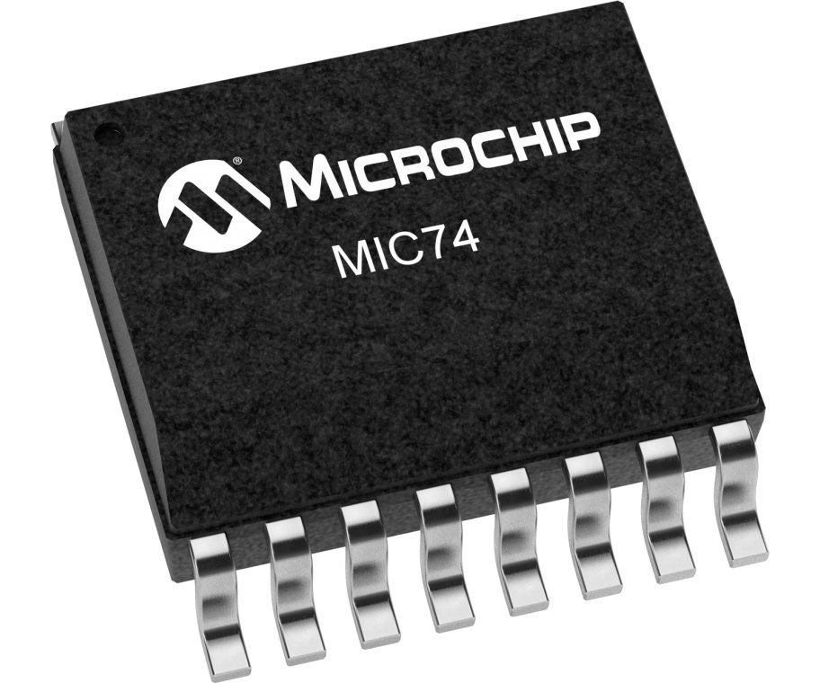
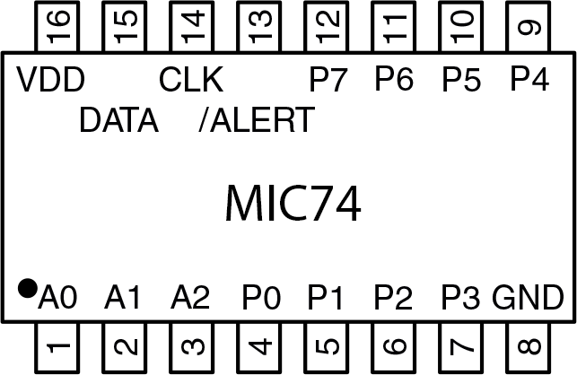
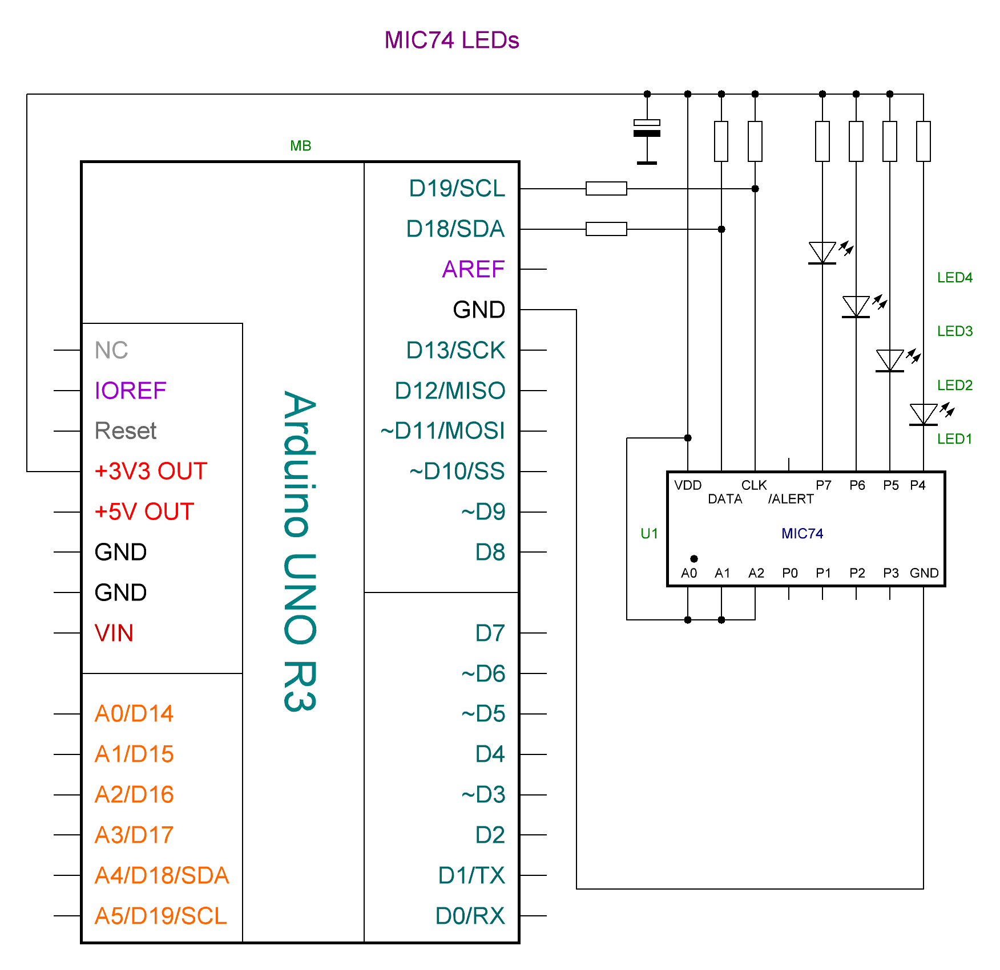

Documentation made in [Open source online Markdown editor](https://pandao.github.io/editor.md/en.html "Open source online Markdown editor") and converted to HTML in [Free Markdown to HTML Converter](https://markdowntohtml.com/ "Convert Markdown to HTML").

## [AnTar MIC74 Arduino Library](https://github.com/TarAndr/AnTar_MIC74)

It is an Arduino Library to control the MIC74 8-Bit I/O Expander. 

The MIC74 device provides 8-bit, general purpose, parallel I/O expansion. It can be controlled via I²C bus applications. It is a great and inexpensive device that allow you to add more peripherals to be controlled by your Arduino board via I²C protocol.

Some Arduino projects may require more pins than the Arduino actually has. In these cases, you can use up to 8 MIC74 devices using only the I²C bus (two Arduino pins) and add up to 64 input / output ports to your project. 

This Arduino library implements the most important functions available on MIC74 device  and can be freely distributed using the MIT Free Software model. 

[Copyright (c) 2023 Tarasenko Andrey](LICENSE).

**Contents**

[TOCM]

[TOC]

- [AnTar MIC74 Arduino Library](https://github.com/TarAndr/AnTar_MIC74 "AnTar MIC74 Arduino Library")

1. [MIT License](#mit-license)
1. [Thanks](#thanks)
1. [Library Features](#library-features)
1. [Demo Video](#demo-video)
1. [Library Installation](#library-installation)
1. [MIC74 brief characteristics](#Brief-characteristics-of-the-MIC74-chip)
1. [Registers](#registers)
1. [API documentation](https://tarandr.github.io/MIC74/extras/apidoc/html/)
1. [Basic Schematic](https://tarandr.github.io/MIC74/#basic-schematic)
1. [Internal Interrupt setup](https://tarandr.github.io/MIC74/#internal-interrupt-setup) 
1. [References](https://tarandr.github.io/MIC74/#references)

### MIT License 

Copyright (c) 2023 Andrey Tarasenko

Permission is hereby granted, free of charge, to any person obtaining a copy
of this software and associated documentation files (the "Software"), to deal
in the Software without restriction, including without limitation the rights
to use, copy, modify, merge, publish, distribute, sublicense, and/or sell
copies of the Software, and to permit persons to whom the Software is
furnished to do so, subject to the following conditions:

The above copyright notice and this permission notice shall be included in all
copies or substantial portions of the Software.

THE SOFTWARE IS PROVIDED "AS IS", WITHOUT WARRANTY OF ANY KIND, EXPRESS OR
IMPLIED, INCLUDING BUT NOT LIMITED TO THE WARRANTIES OF MERCHANTABILITY,
FITNESS FOR A PARTICULAR PURPOSE AND NONINFRINGEMENT. IN NO EVENT SHALL THE
AUTHORS OR COPYRIGHT HOLDERS BE LIABLE FOR ANY CLAIM, DAMAGES OR OTHER
LIABILITY, WHETHER IN AN ACTION OF CONTRACT, TORT OR OTHERWISE, ARISING FROM,
OUT OF OR IN CONNECTION WITH THE SOFTWARE OR THE USE OR OTHER DEALINGS IN THE
SOFTWARE.

### Thanks

* Mrs. [Ricardo Lima Caratti](https://github.com/pu2clr) the [MCP23008](https://github.com/pu2clr/MCP23008/) library he created was taken as a template.

### Library Features

This library uses the I²C communication protocol and implements most important functions offered by MIC74 device from Microchip. It also has primitive functions that make it easier to implement commands that may not have been implemented yet. The main features implemented can be seen below:

* GPIO individual control (8 I/O pins)
* Reading and writing Access to all registers (0x00 ~ 0x06) 
* I²C address customization (0x20 ~ 0x27)
* Output mode configuration (push-pull or open-drain)
* Internal Interrupt feature setup
* Fan speed control

### Demo Video 



[See on Youtube](https://www.youtube.com/watch?v=muUAhf5DGE8)
 

### Library Installation

You can install this library on your Arduino environment using different methods. The best ways to do that are described below.  

#### Installing via Arduino IDE

This is the easiest method to install this library.

On Arduino IDE, select the __"Tools" >> Manage Libraries..."__ item and look for MIC74. Finally select "AnTar MIC74". The images below show the installation process. 

##### Going to Manage libraries...

##### Looking for MIC74

##### Checking the AnTar MIC74 examples

##### More information

See also [Installing Libraries](https://docs.arduino.cc/software/ide-v1/tutorials/installing-libraries)

#### Installing via this repository 

First, you have to [download](https://github.com/TarAndr/AnTar_MIC74/archive/main.zip) this library in zip format. 
After, unzip the AnTar_MIC74-main.zip file in your Arduino Library folder:

* On __Windows__: "My Documents\Arduino\libraries"
* On __MAC OS__: ˜/Documents/Arduino/libraries
* On __Linux__: ˜/Documents/Arduino/libraries

With that approach, you will have the __most current version__ of the library. However, __it may not be the most stable version__. This is because the current version is always in development.
Do you need some old version (release) of this library?  If yes, [check here](https://github.com/TarAndr/AnTar_MIC74/releases). 

### Brief characteristics of the MIC74 chip

The MIC74 chip is a fully programmable serial-to-parallel I/O expander converter that is compatible with the SMBus™ protocol. It operates as a bus client providing eight independent I/O lines.

Each I/O bit can be individually programmed as an input or output. If any pin is programmed as an output, then each such pin can be programmed as an open-drain output or a push-pull output. If desired, four outputs can be programmed to implement fan speed control. An internal clock and status system eliminates the overhead required to control fan speed.

The output pins are capable of directly driving loads such as LEDs. It is possible to use interrupts during state changes on the input pins. This eliminates the need to poll the device each time to obtain pin status information. Three address selection inputs are provided, allowing up to eight devices to be connected and shared on the same bus, providing a total of 64 additional I/Os to your microcontroller.

The MIC74 chip is available in an ultra-compact 16-pin QSOP package. Low quiescent current, small footprint and low chassis height make the MIC74 ideal for portable and desktop applications:

### Registers

This library has two basic function that you can use to control everything on MIC74. You can use [regRead](https://www.youtube.com/watch?v=muUAhf5DGE8) and [regWrite](https://www.youtube.com/watch?v=muUAhf5DGE8) methods to setup the registers below. Also this library has other functions that make the job easier to build applications based on Arduino and MIC74 devices. See [API documentation](https://www.youtube.com/watch?v=muUAhf5DGE8).

| Register | Address | Description |
| -------- | ----- | ------------|
| DEV_CFG  | 0x00  | Device configuration read/write register|
| DIR  | 0x01  | Data direction read/write register|
| OUT_CFG  | 0x02  | Output configuration read/write register|
| STATUS   | 0x03  | Status read register|
| INT_MASK   | 0x04  | Interrupt mask read/write register|
| DATA    | 0x05  | Data read/write register|
| FAN_SPEED   | 0x06  | Fan speed read/write register, Determines bit-pattern on FS[2:0]|

### Functions

#### Setup functions

### Basic schematic

The image below shows a basic MIC74 application with LED. You can control up to 8 LEDs. The I²C bus address is set to 0x27. You can select another I²C address by dealing with the A0, A1 and A2 pins (from 0x20 to 0x27). This circuit uses the MIC74 GPIO PINs as output.   

#### GPIO as output setup

Also this library has other functions that make the job easier to build applications. See [API documentation](https://www.youtube.com/watch?v=muUAhf5DGE8).

