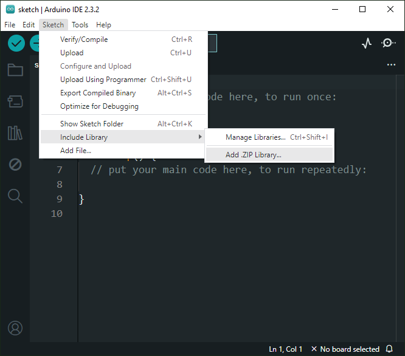

#  [AnTar MIC74 Arduino Library](https://github.com/TarAndr/AnTar_MIC74) 

It is an Arduino Library to control the MIC74 8-Bit I/O Expander. 

The MIC74 device provides 8-bit, general purpose, parallel I/O expansion. It can be controlled via I²C bus applications. It is a great and inexpensive device that allow you to add more peripherals to be controlled by your Arduino board via I²C protocol.

Some Arduino projects may require more pins than the Arduino actually has. In these cases, you can use up to 8 MIC74 devices using only the I²C bus (two Arduino pins) and add up to 64 input / output ports to your project. 

This Arduino library implements the most important functions available on MIC74 device  and can be freely distributed using the MIT Free Software model. 

[Copyright (c) 2024 Tarasenko Andrey](#mit-license).

---

**Content**

- [AnTar MIC74 Arduino Library](https://github.com/TarAndr/AnTar_MIC74 "AnTar MIC74 Arduino Library")

1. [License agreement](#mit-license)
1. [Library Features](#library-features)
1. [Demo Video](#demo-video)
1. [Library Installation](#library-installation)
    * [Manual installation](#manual-installation)
    * [Installing via Arduino IDE](#installing-via-development-environment)
    * [More information](https://docs.arduino.cc/software/ide-v2/tutorials/ide-v2-installing-a-library/)
1. [Description](#mic74-description)
    * [MIC74 brief characteristics](#brief-characteristics-of-the-mic74-chip)
    * [Pin assignment of the MIC74 chip](#pin-assignment)
    * [Description and purpose of registers](#description-and-purpose-of-registers)
    * [Official documentation from Microchip](extras/docs/MIC74-2-Wire-Serial-IO-Expander-and-Fan-Controller-DS20005969A.pdf)
1. [Library methods](#library-methods)
    * [Configuration functions](#configuration-functions)
        * [The main function of setting up and starting the chip](#the-main-function-of-setting-up-and-starting-the-chip)
        * [Configuring Global Interrupt Enablement](#configuring-global-interrupt-enablement)
        * [Enable/disable fan control mode](#enable-or-disable-fan-control-mode)
        * [Simultaneously manage interrupts and fan control mode](#simultaneously-manage-interrupts-and-fan-control-mode)
        * [Setting the pin direction and operating mode of the output](#setting-the-pin-direction-and-operating-mode-of-the-output)
        * [Setting the direction of the entire port at once](#setting-the-direction-of-the-entire-port-at-once)
        * [Configuring interrupt generation on all port pins simultaneously](#configuring-interrupt-generation-on-all-port-pins-simultaneously)
        * [Configuring interrupt generation from a separate input](#configuring-interrupt-generation-from-a-separate-input)
        * [Setting the operating modes of the port output stages](#setting-the-operating-modes-of-the-port-output-stages)
        * [Setting the output stage mode of a separate pin](#setting-the-output-stage-mode-of-a-separate-pin)
    * [Control functions](#control-functions)
        * [Setting logic levels on all pins simultaneously](#setting-logic-levels-on-all-pins-simultaneously)
        * [Setting a specified logic level on a specific pin](#setting-a-specified-logic-level-on-a-specific-pin)
        * [Delayed setting of a given logic level on a specific pin](#delayed-setting-of-a-given-logic-level-on-a-specific-pin)
1. [API documentation](https://tarandr.github.io/MIC74/extras/apidoc/html/)
1. [Basic Schematic](https://tarandr.github.io/MIC74/#basic-schematic)
1. [Internal Interrupt setup](https://tarandr.github.io/MIC74/#internal-interrupt-setup) 
1. [References](https://tarandr.github.io/MIC74/#references)
1. [Thanks](#thanks)
1. [Conclusion](#conclusion)

---

## MIT License 

Copyright (c) 2024 Andrey Tarasenko

Permission is hereby granted, free of charge, to any person obtaining a copy
of this software and associated documentation files (the "Software"), to deal
in the Software without restriction, including without limitation the rights
to use, copy, modify, merge, publish, distribute, sublicense, and/or sell
copies of the Software, and to permit persons to whom the Software is
furnished to do so, subject to the following conditions:

The above copyright notice and this permission notice shall be included in all
copies or substantial portions of the Software.

THE SOFTWARE IS PROVIDED "AS IS", WITHOUT WARRANTY OF ANY KIND, EXPRESS OR
IMPLIED, INCLUDING BUT NOT LIMITED TO THE WARRANTIES OF MERCHANTABILITY,
FITNESS FOR A PARTICULAR PURPOSE AND NONINFRINGEMENT. IN NO EVENT SHALL THE
AUTHORS OR COPYRIGHT HOLDERS BE LIABLE FOR ANY CLAIM, DAMAGES OR OTHER
LIABILITY, WHETHER IN AN ACTION OF CONTRACT, TORT OR OTHERWISE, ARISING FROM,
OUT OF OR IN CONNECTION WITH THE SOFTWARE OR THE USE OR OTHER DEALINGS IN THE
SOFTWARE.

---

## Library Features

This library uses the I²C communication protocol and implements most important functions offered by MIC74 device from Microchip. It also has primitive functions that make it easier to implement commands that may not have been implemented yet. The main features implemented can be seen below:

* GPIO individual control (8 I/O pins)
* Managing an entire port at once
* I²C Address customization (0x20 ~ 0x27)
* I²C Frequency customization 
* Finding the I2C address of a MIC74 device
* Output mode configuration (push-pull or open-drain)
* Internal Interrupt feature setup
* Fan speed control

---

## Demo Video

[See on Youtube](https://www.youtube.com/watch?v=muUAhf5DGE8)

---

## Library Installation

You can install this library on your Arduino environment using different methods. The best ways to do that are described below.  

### Manual installation

First, you have to [download](https://github.com/TarAndr/AnTar_MIC74/archive/main.zip) this library in zip format. 
After, unzip the **AnTar_MIC74-main.zip** file in your Arduino Library folder:

* On __Windows__: "My Documents\Arduino\libraries"
* On __MAC OS__: ˜/Documents/Arduino/libraries
* On __Linux__: ˜/Documents/Arduino/libraries

### Installing via development environment

The downloaded archive can also be integrated through the development environment itself, which will probably be a more correct solution. To do this, in the "**Sketch**" section from the "**Include Library**" list, select "**Add ZIP Library...**" and specify the library archive file:

If the above steps are completed successfully, the message “**Library installed**” should appear in the information window, and examples of installed libraries should appear in the examples of installed libraries for working with the newly added library:

Having opened the selected example, you can start your own project based on it or copy parts of the example code into an existing project that you started earlier. Next we will look at what steps need to be taken to do this.

With that approach, you will have the __most current version__ of the library. However, __it may not be the most stable version__. This is because the current version is always in development.
Do you need some old version (release) of this library?  If yes, [check here](https://github.com/TarAndr/AnTar_MIC74/releases). 

#### More information

See also [Installing Libraries](https://docs.arduino.cc/software/ide-v2/tutorials/ide-v2-installing-a-library/)

---

## MIC74 description
This section discusses in detail the characteristics and capabilities of the MIC74 chip along with its registers, as well as the methods of this library for working with this chip.

### Brief characteristics of the MIC74 chip

The MIC74 chip is a fully programmable serial-to-parallel I/O expander converter that is compatible with the SMBus™ protocol. It operates as a bus client providing eight independent I/O lines.

Each I/O bit can be individually programmed as an input or output. If any pin is programmed as an output, then each such pin can be programmed as an open-drain output or a push-pull output. If desired, four outputs can be programmed to implement fan speed control. An internal clock and status system eliminates the overhead required to control fan speed.

The output pins are capable of directly driving loads such as LEDs. It is possible to use interrupts during state changes on the input pins. This eliminates the need to poll the device each time to obtain pin status information. Three address selection inputs are provided, allowing up to eight devices to be connected and shared on the same bus, providing a total of 64 additional I/Os to your microcontroller.

### Pin assignment

The MIC74 chip is available in an ultra-compact 16-pin QSOP package. Low quiescent current, small footprint and low chassis height make the MIC74 ideal for portable and desktop applications:

- A0, A1, A2 - Client address setting inputs, the three least significant bits of the MIC74 chip address are set;
- P0, P1, P2, P3, P4, P5, P6, P7 - General purpose I/O contacts, direction and type of output user programmable;
- /ALERT - An output with an active low level and an open drain, an interrupt output signal for the host when the logic level changes at the inputs of the microcircuit. The signal is cleared when the bus host polls the ARA (alert response address = 0001100) or reads the status;
- CLK - The host provides the clock clock on this input;
- DATA - Serial data input and serial data output with open drain.

In addition, pins 9, 10, 11, 12 have an alternative fan control function, when enabled, they are designated as /SHDN, /FS0, /FS1, /FS2. When the fan control mode is enabled, the /SHDN pin controls the start/stop of the fan, and the /FS0, /FS1 and /FS2 pins control its rotation speed.

### Description and purpose of registers

For configuration and control, the MIC74 chip has 7 registers, each of which consists of 8 bits:

| Register | Address | Description |
| -------- | ----- | ------------|
| DEV_CFG  | 0x00  | Device configuration read/write register|
| DIR  | 0x01  | Data direction read/write register|
| OUT_CFG  | 0x02  | Output configuration read/write register|
| STATUS   | 0x03  | Status read register|
| INT_MASK   | 0x04  | Interrupt mask read/write register|
| DATA    | 0x05  | Data read/write register|
| FAN_SPEED   | 0x06  | Fan speed read/write register, Determines bit-pattern on FS[2:0]|

- DEV_CFG - Chip configuration register, the two least significant bits of which set operating modes, such as global interrupt enable and fan control. The remaining bits are reserved and must always be set to zero. After the chip starts up, by default all bits of this register are set to zero, meaning that interrupts and fan control mode are disabled. To enable interrupts, you need to set the zero bit, and to control the fan, set bit number 1 to one, for example, by writing the value 0b00000011 to the register. The register is intended for both writing and reading.;
- DIR - Register for setting all or individual pins to work as inputs or outputs. Once enabled, the register has a default value of 0b00000000 and all pins are configured as inputs. Accordingly, to configure a separate pin to operate as an output, the corresponding bit of this register must be set to one. You can also read set values from the register. If the chip is configured for fan control, the P[7:4] pins are automatically configured as open-drain outputs, and the DIR register does not affect the operation of these pins;
- OUT_CFG - Register for setting all or individual pins configured as outputs to operate in push-pull or open-drain mode. The default register value is 0b00000000 and all output stages are configured to operate in open drain mode. Accordingly, to configure a separate output to operate in push-pull mode, the corresponding bit of this register must be set to one. You can also read set values from the register. If the chip is configured for fan control, the P[7:4] pins are automatically configured as open-drain outputs, and the OUT_CFG register does not affect the operation of these pins;
- STATUS - The bits of this register record events of changes in the logical level at the corresponding pins of the microcircuit, configured as inputs. The bit is set to one when the logic level changes at the corresponding input, and if no change occurs, the bit is reset to 0. The register is read-only, and all its bits are reset to 0 after this operation is performed. If the chip is configured for fan control, the P[7:4] pins are automatically configured as open-drain outputs, and no interrupts are generated by changing the logic levels on these pins;
- INT_MASK - Interrupt enable register on the required pins configured as inputs, and the corresponding bits of which are set to one in this register. The register is used for reading/writing. If the chip is configured for fan control, the P[7:4] pins are automatically configured as open-drain outputs, and no interrupts are generated by changing the logic levels on these pins;
- DATA - The register displays the current state of any pin configured as an input and the last value applied to a pin configured as an output. Writing a value to the DATA register sets the state of any pin configured as an output; writes to I/O bits configured as inputs are ignored. By default, all register bits are set to one. If the chip is configured for fan control, the P[7:4] pins are automatically configured as open drain outputs and their logic levels are controlled by the FAN_SPEED register, and the DATA register does not affect the operation of these pins;
- FAN_SPEED - Fan operation control register, in which the three least significant bits are used. Any time the register contains a value of zero, it means the fan is off, and if a non-zero value is written to it, the /FS[2:0] and /SHDN outputs will go to the maximum fan speed state for approximately one second (tSTART). After this interval, the state of the fan speed control outputs will take the value specified in the contents of the FAN_SPEED register. This ensures that the fan starts reliably even when low speed operation is required. The dependence of the fan rotation speed on the value of the low-order bits of the register is shown in the following table, with “Speed 1” corresponding to the lowest, and “Speed 7” the highest actual fan rotation speed.

[Official documentation from Microchip](extras/docs/MIC74-2-Wire-Serial-IO-Expander-and-Fan-Controller-DS20005969A.pdf)

---

## Library methods

This library has two categories of functions that you can use to control everything on the MIC74. The first category includes configuration functions and is used less frequently, while the second category consists of control functions and is used more often. This library also has other auxiliary functions that simplify the creation of applications based on Arduino and MIC74 devices. See [API documentation](https://tarandr.github.io/MIC74/extras/apidoc/html/).

### Configuration functions

This section contains a list of functions required to configure device settings.

#### The main function of setting up and starting the chip:

`begin(i2cAddress, i2cFrequency);`

- i2cAddress: address of the custom chip in the range from 0x20 to 0x27;
- i2cFrequency: sets the operating frequency of the I2C bus in Hertz.

When calling the `begin();` function without parameters, communication with the chip will be established with default values.

Also, when calling the function begin(i2cAddress); where i2cAddress is the required address value, by default only the bus frequency will be set.

And finally, complete setting of the parameters of both address and frequency by calling the function `begin(0x25, 400000);` where, for example, the value **0x25** is passed as the address, and the frequency is set to **400000** Hertz.

#### Configuring Global Interrupt Enablement:

This function can enable/disable global interrupts:

`setInterrupts(value);`

- **value**: numeric value, zero or one, OFF or ON.

Usage examples:

- `setInterrupts(ON);` - resolution of global interrupts;
- `setInterrupts(OFF);` - prohibition of global interrupts.

#### Enable or disable fan control mode:

`fanMode(value);`

- **value**: numeric value, zero or one, OFF or ON.

Usage examples:

- `fanMode(ON);` - switches the chip to fan control mode;
- `fanMode(OFF);` - disables the fan control operating mode.

### Simultaneously manage interrupts and fan control mode:

A single function to simultaneously manage interrupts and set the fan control mode:

`setup(ie, fan);`

- **ie**: numeric value, zero or one, OFF or ON;
- **fan**: numeric value, zero or one, OFF or ON.

Examples of using:

- `setup(ON, ON);` - enables global interrupts and switches the chip to fan control mode;
- `setup(ON, OFF);` - enables global interrupts and disables the fan control mode;
- `setup(OFF, ON);` - disables global interrupts and switches the chip to fan control mode;
- `setup(OFF, OFF);` - disables global interrupts and disables the fan control mode.

#### Setting the pin direction and operating mode of the output:

`pinMode(pin, mode);`

- **pin**: port pin 0 to 7;
- **mode**: the desired operating mode of the specified INPUT, OUTPUT, INPUT_WITH_INTERRUPT or OUTPUT_PUSHPULL pin.

This function interacts with three registers at once and, in addition to specifying the output direction, can set an interrupt mask for it, in the case of setting the output to an input, or a push-pull mode for the output stage, in the case of setting the output to an output. In the case of simply specifying a pin to operate as an input, interrupts for it will be disabled, and for operation as an output, the operating mode of the output stage will be set to open drain.

#### Setting the direction of the entire port at once:

`writePortMode(value);`

- **value**: a specified value, which for clarity is conveniently represented as a bit field 0bxxxxxxxx.

Where in the required positions “0” or “1” is written instead of “x”, for example writePortMode(0b11111111); will simultaneously set all pins of the chip to the output direction, and writePortMode(0b00000000); accordingly to the entrance.

`readPortMode();`

- **return value**: a number from 0 to 255 containing a bit field of the specified directions for all pins.

#### Configuring interrupt generation on all port pins simultaneously:

`writePortInterrupts(mask);`

- **mask**: a specified value, which for clarity is conveniently represented as a bit field 0bxxxxxxxx.

Where in the required positions “0” or “1” is written instead of “x”, for example writePortInterrupts(0b11111111); will simultaneously assign interrupt generation to all chip pins when the logical level changes on any of them, and writePortInterrupts(0b00000000); accordingly, it will disable interrupt generation from all pins.

`readPortInterrupts();`

- **return value**: a number from 0 to 255 containing the bit field of the set interrupt mask for the inputs.

#### Configuring interrupt generation from a separate input:

`interruptPinOn(pin);`

- **pin**: port pin 0 to 7.

Example: interruptPinOn(3); will assign interrupt generation when the logical level changes at pin P3 of the microcircuit;

`interruptPinOff(pin);`

- **pin**: port pin 0 to 7.

Example: interruptPinOff(3); will disable the generation of interrupts from the P3 pin of the microcircuit.

#### Setting the operating modes of the port output stages:

`writePortOutMode(value);`

- **value**: a specified value, which for clarity is conveniently represented as a bit field 0bxxxxxxxx.

Where in the required positions “0” or “1” is written instead of “x”, for example writePortOutMode(0b11111111); will simultaneously assign the push-pull mode of operation of their output stages for all chip outputs, and writePortOutMode(0b00000000); will switch the output stages of all outputs to open drain mode.

`readPortOutMode();`

- **return value**: a number from 0 to 255 containing a bit field of the specified operating modes of all outputs.

#### Setting the output stage mode of a separate pin:

`pushPullPinOn(pin);`

- **pin**: port pin 0 to 7.

Example: pushPullPinOn(3); will set the push-pull mode of operation of the output stage of the P3 output of the microcircuit;

`pushPullPinOff(pin);`

- **pin**: port pin 0 to 7.

Example: pushPullPinOff(3); will switch the output stage of pin P3 to open drain mode.

### Control functions

In all digital devices, control involves reading or writing the states of all or specific port pins, as well as reading and writing signals from additional auxiliary pins, if any.

In this case, the pins can be configured as either outputs or inputs; accordingly, there are functions for both writing and reading the specified states. Additionally, pins configured as outputs can operate in push-pull or open-drain mode, and pins configured as inputs can generate interrupts or not use them.

This section contains a list of functions according to the available control options.

#### Setting logic levels on all pins simultaneously:

`portWrite(value);`

- **value**: the value to be written, which for clarity is conveniently represented as a bit field 0bxxxxxxxx.

Where in the required positions “0” or “1” is written instead of “x”, for example `portWrite(0b11111111);` will simultaneously set the high logical level on all chip pins, and `portWrite(0b00000000);` correspondingly low.

#### Setting a specified logic level on a specific pin:

`digitalWrite(pin, value);`

- **pin**: port pin 0 to 7;
- **value**: HIGH or LOW value to be written.

For example `digitalWrite(3, HIGH);` will set the P3 pin of the chip high, and `digitalWrite(3, LOW);` low logic level on the same pin.

Additional alternative functions `pinToHigh(pin);` and `pinToLow(pin);` to set the high and low logic levels at the specified pin of the pin, respectively.

For example `pinToHigh(3);` will set the logic level high at pin P3 of the microcircuit, and `pinToLow(3);` will set the logic level low on the same pin.

#### Delayed setting of a given logic level on a specific pin:

In the case when all or most of the pins are configured to work as outputs, and different pins are controlled by separate functions, during the program operation different sections of the program will change different bits of the I/O port, and each time a physical change in the states of the pins may entail an increased load to the bus and to the control microcontroller. In some cases, you can optimize the operation of the system and send values to the port once per cycle, or update the port value at certain time intervals, for example, by interrupts. To do this, the accumulated changes will be stored in a buffer, and then the buffer value will be physically sent to the port of the chip.

For these purposes, the same functions for setting levels on the chip pins were implemented with the word “delayed” added to their names, which means delayed recording. You will also need an additional function that will send the buffer value to the port according to a given schedule:

`digitalWriteDelayed(pin, value);`

- **pin**: port pin 0 to 7;
- **value**: HIGH or LOW value to be written.

`pinToHighDelayed(pin);` and `pinToLowDelayed(pin);`

**portWrite();** - overloaded function of the same name **portWrite(value);** called without parameters (the accumulated buffer value is automatically taken as a parameter), physical recording of the buffer value into the port register.

The main thing is to approach the use of the latter functions consciously, since anomalies can occur when one section of code sets the logical level of a certain output, on which the logic of the operation of further algorithms following this section depends, and the physical writing of the value to the port has not yet occurred. It is also natural that it will not be possible to use deferred recording where delays are used in the program code; if, for example, we want to turn on an LED for a second, and sending a buffer to the port will wait for its lighting time to expire, then no physical lighting of the LED will occur at all. In addition, it is not recommended to mix and use delayed recording functions with regular immediate recording functions.

---

## Basic schematic

The image below shows a basic MIC74 application with LED. You can control up to 8 LEDs. The I²C bus address is set to 0x27. You can select another I²C address by dealing with the A0, A1 and A2 pins (from 0x20 to 0x27). This circuit uses the MIC74 GPIO PINs as output.   

### GPIO as output setup

Also this library has other functions that make the job easier to build applications. See [API documentation](https://www.youtube.com/watch?v=muUAhf5DGE8).

---

## Thanks

* Mrs. [Ricardo Lima Caratti](https://github.com/pu2clr) the [MCP23008](https://github.com/pu2clr/MCP23008/) library he created was taken as a template.

Documentation created with the [Markdown Monster](https://markdownmonster.west-wind.com/ "Markdown Monster").
